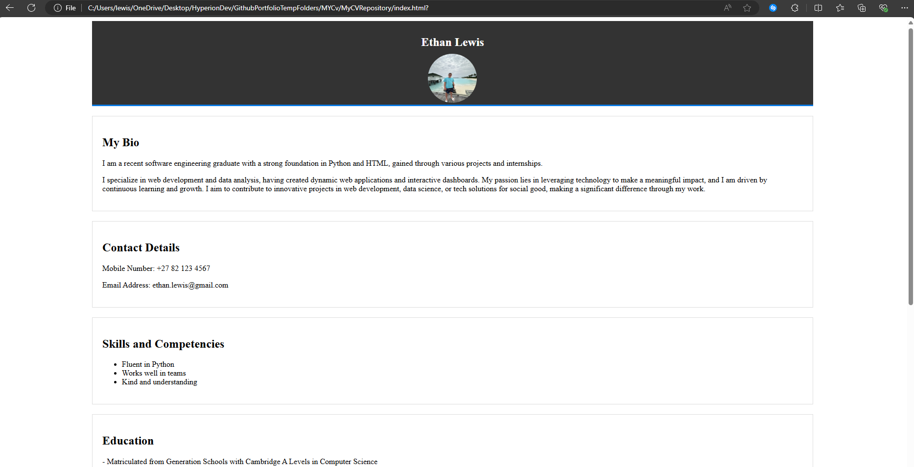

# My CV

## Table of Contents

- [Description and Content](#description-and-content)
- [Installation](#installation)
- [Usage](#usage)
  - [Example Interaction](#example-interaction)
- [Installation](#Repository-Link)
- [Credits](#credits)

## Description and Content
Welcome to my personal CV site that I created. I made this site to showcase my skills, education, and work experience. In the bio section, you can learn about my background in software engineering, my passion for web development and my career. The contact section provides my phone number and email address. In the skills section, you will see my skills, including my understanding in Python and teamwork abilities. The education and work experience section allows you to review my educational achievements and any internships. 
I designed this website with HTML and CSS using Visual Studio Code.

## Installation

To install and run this project locally, follow these steps:

1. **Clone the repository in your terminal/command prompt**:

    - Make sure you have created a temporary folder for this repository.

   ```sh
   git clone https://github.com/ethanlewis938/MyCVRepository
   ```
2. **Navigate to the project directory**:
    Find the project directory in your files and navigate to it.
    
3. **Run the program**:

   - On Windows:
      - Right click on the index file and open with any browser.

## Usage

After installing the project, you can use it by following these steps:

1. **Run the program**:

   - On Windows:
      - Right click on the index file and open with any browser.

**2. Interact with the program**

After cloning the repository and navigating to the project directory, you can use the website to learn more about my professional background. Follow these steps:

1. **Open the Website**: Launch the `index.html` file in your preferred web browser.

2. **Navigate Through Sections**:
   - **Bio**: Read about my background in software engineering, web development, and data analysis.
   - **Contact**: Find my phone number and email address for easy communication.
   - **Skills**: Discover my key skills, including Python proficiency and teamwork abilities.
   - **Education & Work Experience**: Review my educational achievements and professional internships.
   <br>

3. **Search Form**: Although the search form is currently non-functional, it is included as a placeholder for future development.

4. **Contact Form**: Similarly, the contact form is not yet functional but provides a framework for visitor messages.

### Example Interaction


**- Website**


<br>

## Credits

Lead Programmer

- Ethan Lewis [GitHub Profile](https://github.com/ethanlewis938/)

## Repository Link

[View the Repository](https://github.com/ethanlewis938/MyCVRepository)
